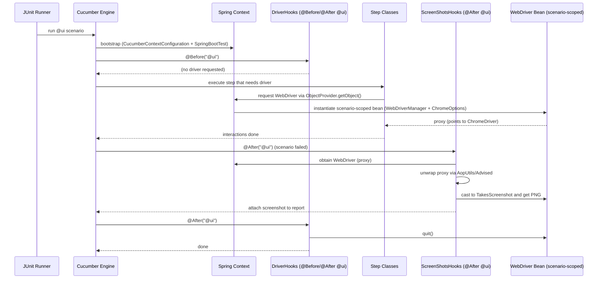

# How UI starts & how screenshots work (current setup)

This documents what happens then screenshots attach:
- `ui/config/WebDriverConfig.java` — scenario-scoped, lazy WebDriver bean (Chrome)
- `test/hooks/DriverHooks.java` — `@Before/@After` restricted to `@ui` scenarios, teardown after UI
- `test/hooks/ScreenShotsHooks.java` — `@After("@ui")` that **unwraps the Spring proxy** (if any) and attaches a screenshot on failure

---

## High-level flow (text)

1. **Runner → Cucumber engine** discovers `@ui` scenario(s).  
2. **Cucumber ↔ Spring bridge** starts Spring test context (`@SpringBootTest`).  
3. **Beans are lazy**; nothing UI-related is created yet.  
4. **Before @ui** (DriverHooks): may perform lightweight init (does **not** force driver creation).  
5. **First UI step** or hook that actually touches the driver calls `ObjectProvider.getObject()` → Spring creates the **scenario-scoped** WebDriver bean:
   - WebDriverManager resolves ChromeDriver
   - ChromeOptions configured (headless/window size, etc.)
   - Spring returns a **scoped proxy** for the bean to the caller (JDK or class-based proxy).
6. Steps run, interacting with the page objects using the driver.
7. **After @ui (ScreenShotsHooks)**:
   - If scenario **failed**, it **unwraps** the Spring proxy (using `AopUtils`/`Advised`) to get the **target ChromeDriver**.
   - Casts to `TakesScreenshot`, grabs PNG bytes, `scenario.attach(...)`.
8. **After @ui (DriverHooks)** runs **after** the screenshot hook, calling `quit()` and cleaning up the session.

> If you switch the bean to return `ChromeDriver` and/or use `proxyMode = TARGET_CLASS`, the unwrap step becomes optional; the cast to `TakesScreenshot` will pass directly.

---

## Sequence (Mermaid)

