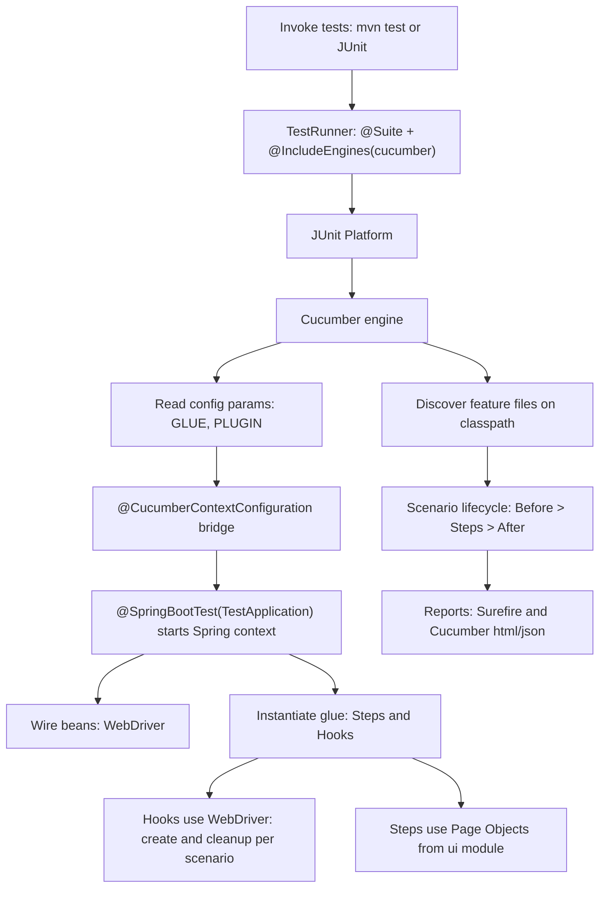

# Test Execution Flow (JUnit Platform Suite + Cucumber + Spring)

This document explains how tests start and run in the current setup when you trigger them from **JUnit** (IntelliJ) or **Maven** (`mvn test`).

---

## High-level flow

---

## Step-by-step

1. **Run tests**  
   - CLI: `mvn test -Dspring.profiles.active=test`  
   - IntelliJ: Run the `TestRunner` class as a JUnit test.

2. **JUnit Platform Suite** picks up `TestRunner`  
   - `@Suite` + `@IncludeEngines("cucumber")` instruct JUnit to run **Cucumber**.
   - Optional `@SelectClasspathResource("features")` focuses discovery root.
   - `@ConfigurationParameter` entries configure GLUE & PLUGIN.

3. **Cucumber Engine** starts  
   - Discovers feature files and glue.  
   - Reads parameters from the runner, `junit-platform.properties` (if present), and system properties.

4. **Cucumber–Spring integration**  
   - `@CucumberContextConfiguration` enables Spring object factory for glue.  
   - `@SpringBootTest(classes = TestApplication.class)` boots a **Spring test context** for scenarios.

5. **Spring context**  
   - Profile `test` (when passed) activates `application-test.yaml`.  
   - Beans are wired (`WebDriver`, page objects, utilities).

6. **Scenario lifecycle**  
   - `@Before` hooks prepare state (and ensure WebDriver exists).  
   - Steps call **page objects** in the `ui` module to drive the browser.  
   - `@After` hooks quit the driver; beans may also define `destroyMethod="quit"`.

7. **Reporting**  
   - Surefire prints a summary; Cucumber plugins write `target/cucumber-report.html` and `target/cucumber.json`.

---

## Quick sanity checklist

- Runner uses **`@Suite` + `@IncludeEngines("cucumber")`** (no `@Cucumber`).  
- Glue includes **steps + hooks + config** packages.  
- `@CucumberContextConfiguration` + `@SpringBootTest` present.  
- `WebDriver` bean: scoped for isolation (Scenario/Thread) and **always quit** in `@After` and/or via `destroyMethod="quit"`.  
- Headless default + window size if tests are layout-sensitive.
